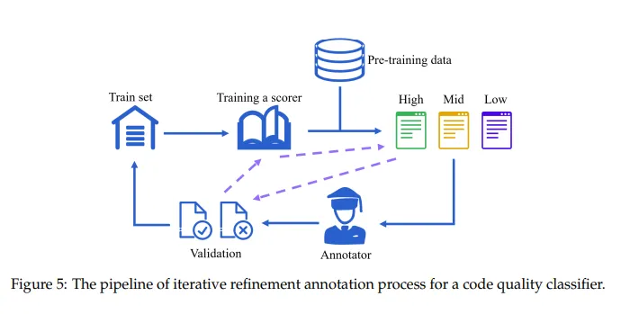
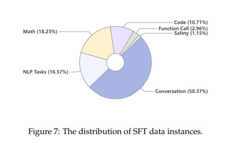
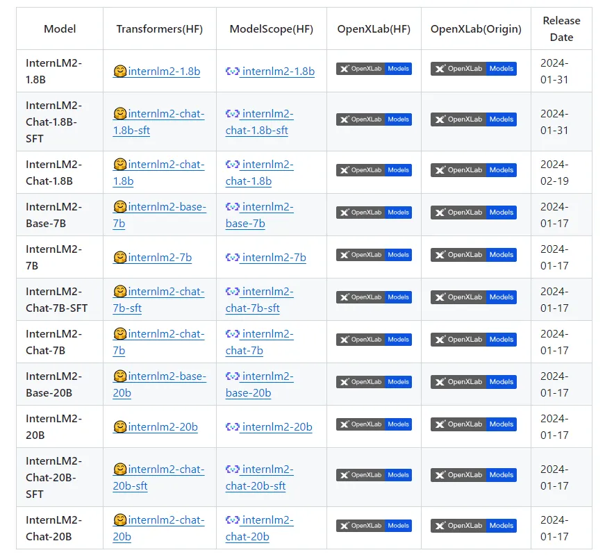

> [InternLM2技术报告](https://arxiv.org/pdf/2403.17297.pdf)

### 技术亮点

- 全面的预训练数据处理：预训练阶段是模型开发中至关重要的一环，它为模型后续的微调和优化奠定了坚实的基础。预训练过程涉及数据准备、预训练设置和不同的预训练阶段。报告中给出了较为详细的预训练数据处理，从文本、代码以及长上下文数据都给出了对应的处理方法。
- 卓越的长文本处理能力：通过引入Group Query Attention（GQA）技术，InternLM2显著降低了长文本推理的内存占用，使模型能够有效处理高达32k的文本长度，在处理极长文本时展现出色的理解能力。GQA技术在往期文字中我们也有介绍：【全网首发】聊聊并写写GQA（Group Query Attention）
- 创新的对齐策略：在对齐策略上，InternLM2通过监督式微调（Supervised Fine-Tuning, SFT）和基于人类反馈的强化学习（Reinforcement Learning from Human Feedback, RLHF）来进行对齐，以确保其输出与人类的指令和价值观保持一致。
- 预训练框架：InternEvo训练框架，能够在数千个GPU上高效训练，支持长序列训练，并具备强大的容错能力和交互式训练功能。

通过收集大量代码样本、初步自动化标注、深入的人工审核、反馈循环和专家参与，不断提高模型对编程代码质量的识别和评估能力。

InternLM2推出了1.8b、7b、20b参数的版本，并且还提供了经过特定微调（SFT）的针对对话（chat）应用优化的模型。

